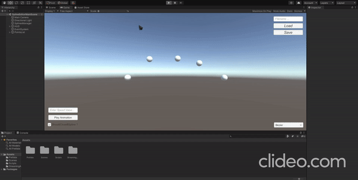
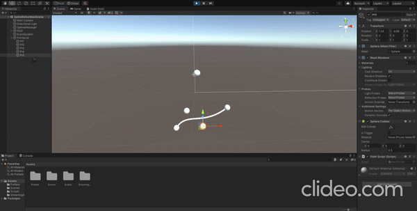
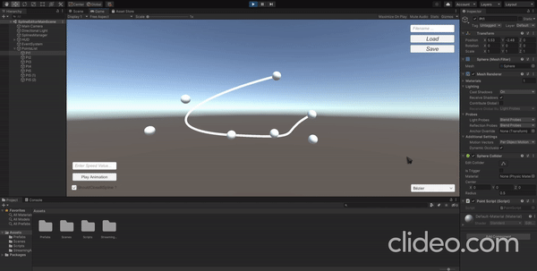
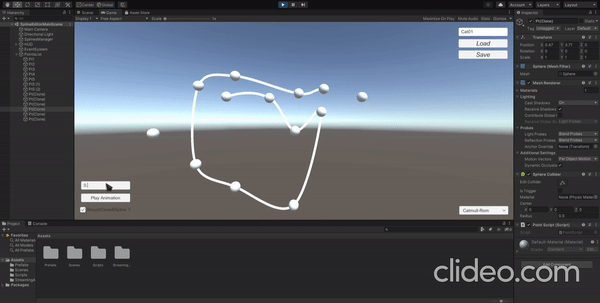
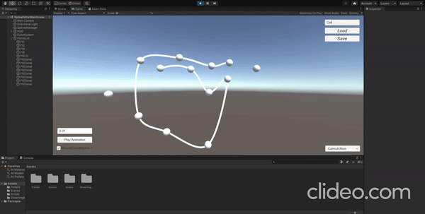

# SplineEditor
## Features

- Calcul des points des courbes splines Hermite, Bézier, B-Spline, Catmull-Rom.
- Affichage des courbes.
- Modification des points de contrôle en temps réel.
- Sauvegarde et chargement des datas (avec serialization dans des fichiers .dat).
- Tracé réel de la spline dans la fenêtre de jeu (line renderer).
- Animation d’un objet le long d’une spline (Avec rotation, et vitesse modifiable).
- Ajout / insertion / suppression de points de contrôle (en temps réel, les animations s'adaptent aussi).
- Concaténation de deux splines.
- Changement du type de spline en temps réel.
- UI permettant de modifier certains paramètre directement dans la fenêtre de jeu (animation, load/save, type, etc).

## Comment l'utiliser ?

- Pour Ajouter/Modifier/Supprimer un point de controle il faut utiliser la scene view/ la hierachie d'unity.
- Le reste se gère directement dans la fenêtres de jeux via l'UI.

## Installation

Il suffit de clone le projet via la commande : git clone git@github.com:Korotsu/SplineEditor.git.
puis de lancer le projet via le hub unity.

## Demo

